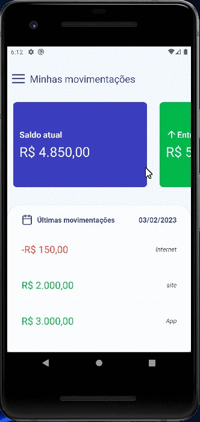

# Finanças App 

Projeto desenvolvido para a prática de React Native.

## Demonstração

## Stacks utilizada no Front

1 React Native
2 Styled-components
3 Bibliotecas utilizadas 
* [date-fns](https://date-fns.org/)
* [react-native-calendars](https://github.com/wix/react-native-calendars)
* [Axios](https://www.npmjs.com/package/axios)
